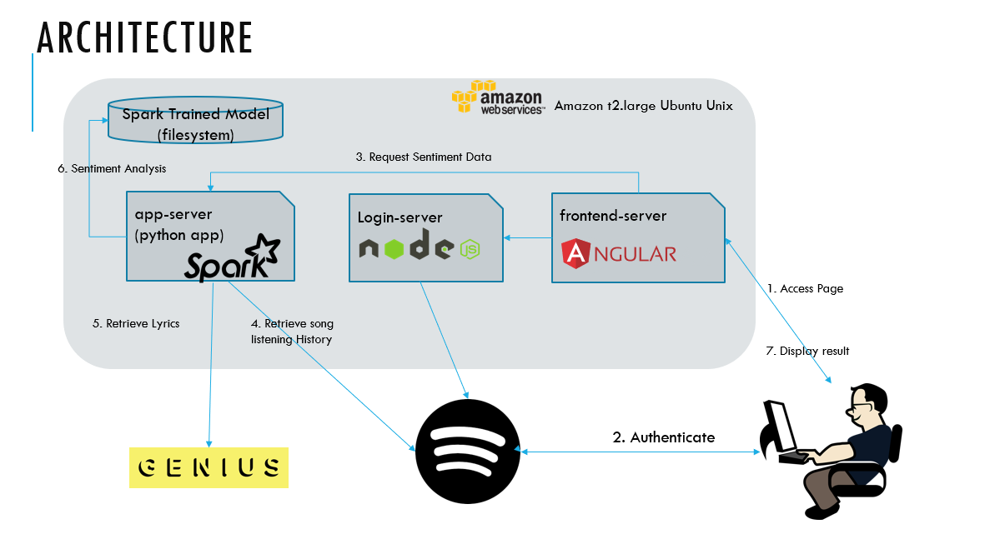

# Parental oversight on Spotify: Sentiment Analysis of Listening Data
CS410 Text Information Systems Project (Fall 2019)

## Team members: 
* Sam Parmar (team lead)
* Vijay Mishra 
* Pragya Mishra 

## Background:
* Spotify is an audio streaming platform created by the Spotify Technology S.A. company originally
out of Sweden
* Individuals can listen via free memberships or premium memberships. Premium memberships can
be individual, family or student.
* As Spotify has gained popularity, more and more children are using the platform to listen to music.
* As of November 2019, Spotify does not currently have parental control for family accounts.
   * The feature is being developed by the folks at Spotify for parents to control many family accounts. 
   * There is an explicit content filter, however accounts must individually have the explicit content filter enabled or disabled.

## Function of tool:
The project focuses on parental oversight with Spotify. Parents with access and control over their son or daughter’s Spotify accounts will be equipped with a simple tool to analyze trends in listening history and understand emotional content of the listening choices (listened to songs) of their children. 

## Use cases: 
* By allowing parents to track listening history and explore listening trends over time, parents can be alerted  abnormal listening choices or sudden change in listening choices that may indicate a shift in the child's mood. Such a mood change in the child may be due to external circumstances such as bullying or association with bad company. 
* Additionally, non-parents can also utilize the tool to assess their own music choices which may also coordinate with personal mood. 

## Software implementation documentation:
1. Angular UI - front end code running under port 4200 (under angular-app)
directory - angular-app  
ng serve --host 0.0.0.0 --port <port> --disable-host-check

2. Python App Server (4201) - Backend Server which does all the heavy lifting. Server exposes REST API which performs data pull from Spotify, Lyrics pull from Genius and Sentiyment Analysis with Logistic Regression trained model created offline. Fcache is used to catch Lyrics and Sentiment data to speed processing. First attempt to perform analysis may take a minute but subsequent calls will be faster. 
python3 app-server.py  
   1. User song data pull with Spotify api
   1. Lyrics data pull Genius api pull (using song info obtained form Spotify api)
   1. Sentiment analysis (using lyrics data obtained from Genius api)
 
3. Login server (4202) (borrowed from Obscurify) implements the oauth flow for Spotify. For this project we are using implicit authorization.
directory - angular-app
node login_server.js <client id> <secret>
   1. Note: The OAuth 2.0 Implicit Grant type is utilized for authentication w/ short lived access tokens.

### Tools used in software development: 
* `Python 3.7`
* `PySpark`
* `spotipy`, `lyricsgenius`, `flask`, `json`, `types`, `fcache`, `pyspark.sql`, `pyspack.ml`, `pandas`, and `numpy`  python packages
* Spotify and Genius Lyrics APIs
* `Angular 8'
* `NodeJs`
* Amazon Web Services (Infrastructure)
 
### Files in the repo:
* `app-server.py` - python app server which implements the rest API for the UI and all the three functions (spotify pull, genius pull, and sentiment analysis)
* `sentiment_model_training.py` - sentiment model training application to generate the model that we used
* `prediction-pipeline/` - persistent sentiment analysis model (created by sentiment_model_training.py)
* `sentiment_prediction.py` - sentiment prediction based on generated sentiment mode (using the prediciton pipeline from sentiment_model_training.py)
* `dataset` - raw training data for sentiment analysis model we generated
* `api/` directory - spotify API and genius API implementations 
* `angular-app/` - user interface and login server code 
* `additionals` - additional jupyter notebook code which was not integrated due to time constraints
* `images` - images used in README.md

### Sentiment analysis implementation:

For training model on sentiments, a subset of tweet data available at https://data.world/crowdflower/sentiment-analysis-in-text was used. 

| Sentiment | Count of Records |
| :---: | :---: |
|anger	| 110 
|happiness	| 5209 
|neutral	| 8638 
|sadness	| 5165 
|Grand Total	| 19122 

Accuracy of the model trained with Logistic Regression is 58.8%. model-training.log contains the training with details of final result.

Note that model can be improved further by training it against all the data. Because of limited compute power, we couldn’t use the full dataset as process was running out of memory. Also, for sentiment “anger”, very limited dataset was available and that can be improved as well. 

## Software usage documentation (how to use the app):
1. Visit the following link in your web browser: `http://3.15.223.174:4200/`
1. Login with Spotify account. 
    1. Authorize access to proceed
    1. Proceed anyways if warning appears that the connection is not private. For this project, we did not purchase a security certificate. 
    1. If on Mac and using Google Chrome, then please see these stackoverflow [instructions](https://stackoverflow.com/questions/58802767/no-proceed-anyway-option-on-neterr-cert-invalid-in-chrome-on-macos) or use Firefox.
1. Wait for tool to process song data
1. Review music choices and see trends
   1. Emotional content of music choices is plotted in trend graph via sentiment analysis
   
## Additional notes, limitations, and future direction
* This tool is only for English songs with lyrics (not non-English languages songs or music without lyrics such as many electronic or classical music songs)
* Spotify only allows last 50 songs to be retrieved. Persistence in this app to store
historical information would provide better historical insights. We did not have enough
time to implement this.
* Model can be improved further by training it against all the data. Because of limited
compute power, we couldn’t use the full dataset as machine was running out of
memory.
* For Sentiment “anger”, very limited dataset was available and that can be improved
as well.
* More views can be generated to provide varying insights into listening history for the
user. Incorporating Spotify’s own audio features can also help improve this solution.

## Contribution of each team member:
* All team members collectively came up with the idea for the project
* Sam Parmar was the team leader for the project. Sam led work with the Spotify and Genius APIs to pull/parse song and lyrics data. He  assisted Pragya and Vijay in the web programming, and he outlined the presentation and maintained documentation. 
* Vijay Mishra developed the sentiment analysis model to assess emotions conveyed in text. Vijay also led the  web programming for the project by developing the app server and login server on AWS. Vijay developed the UI, persistent caching, and website security certificates to avoid browser privacy error. 
* Pragya Mishra assisted in the web programming defining the JSON format data and ensured the sub-programs effectively linked together.

## Acknowledgements and References:
* The Obscurity project was consulted for implementation of login server (https://github.com/alexolivero/Obscurify).
* The Glitch spotify implicit grant template was consulted for OAuth implementation (https://glitch.com/~spotify-implicit-grant).
